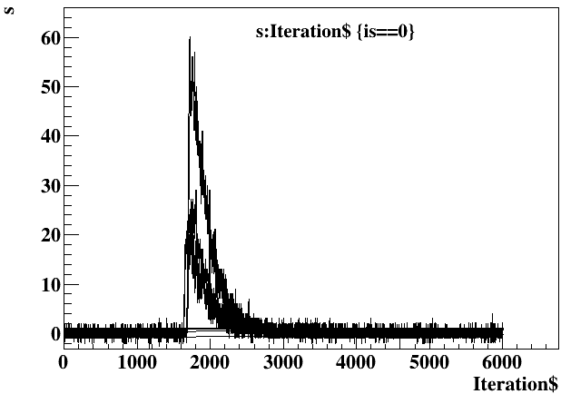

[Bash][], [Python][] and [ROOT][] scripts for the process of digital waveforms taken with a [CAEN][] [digitizer][] and its [WaveDump][] readout program.

[Bash]:https://en.wikipedia.org/wiki/Bash_(Unix_shell)
[Python]:https://www.python.org/
[ROOT]:https://root.cern.ch
[CAEN]:https://www.caen.it/
[digitizer]:https://www.caen.it/sections/digitizer-families/
[WaveDump]:https://www.caen.it/products/caen-wavedump/

[](run)
[](run/0)

## Prerequisites

CERN [ROOT][] is needed to run scripts ended with `.C`. [Shell scripts][sh] can be run in a Linux or Mac terminal. They can also be run in [MobaXterm][] in a Windows PC.

[CAEN][] [WaveDump][] is not needed to run the scripts here, but its output is the input for these scripts.

[sh]:https://www.shellscript.sh/
[MobaXterm]:https://mobaxterm.mobatek.net/

## Get started

- download the package from <https://github.com/jintonic/toward.git>
- get into folder [run](run) in your local copy, create a directory there with its name to be an integer run number, for example, **153**
- get into the just created subdirectory and create a [WaveDump][] configuration file there named **WaveDumpConfig.txt** (one can take [run/0/WaveDumpConfig.txt](run/0/WaveDumpConfig.txt) as an example)
- run `wavedump WaveDumpConfig.txt` there to create binary output file **wave?.dat**, where **?** is the channel number
- get back to the base directory, run `./w2r.sh <run number> <channel number>` to convert **wave?.dat** to **wave?.root**
- use other scripts to process the generated root file

## Scripts

- [w2r.C](w2r.C): a [ROOT script][] to convert a [CAEN][] [WaveDump][] binary output to [ROOT][] format, align baselines of waveforms to zero, and save basic parameters of waveforms
- [w2r.sh](w2r.sh): a [shell script][sh] to fetch information from a [WaveDump][] configuration file and pass it to [w2r.C](w2r.C)
- [q2i.C](q2i.C): a [ROOT script][] to get heights of charge pulses using [trapezoidal filter](https://nukephysik101.wordpress.com/2020/03/20/trapezoid-filter/) and convert charge pulses to current ones using [numerical differentiation](https://terpconnect.umd.edu/%7Etoh/spectrum/Differentiation.html)
- [i2q.C](i2q.C): a [ROOT script][] to convert current pulses to charge ones
- [integrate.C](integrate.C): a [ROOT script][] to integrate waveforms in a certain range and save the result to the original data [tree][]
- [show.py](show.py): a [Python][] script to show waveforms in a [ROOT][] file.

## Features

- Works with [WaveDump][] without any modification of code on both sides
- All scripts can be run directly in Linux, Mac and Windows without compilation and installation
- [Data](run#data-structure) are saved as basic types in [ROOT][] [TTree][] [ntuple][]s, which can be easily open without loading extra libraries defining complicated data structure. [Uproot][] can be used to load the data for analysis in [Python][]
- Super short variable names for quick analysis using [ROOT][] [TTree][]::[Draw][] function in a [ROOT interactive session](https://root.cern.ch/root/html534/guides/users-guide/GettingStarted.html). For example,
```cpp
[root] t->Draw("s:Iteration$","is==0","l",5,2)
```
shows 5 non-saturated (`is==0`) waveforms (`s`: individual waveform samples, [Iterations][Draw]\$: sample index) starting from event 2:



[tree]:https://root.cern.ch/doc/master/classTTree.html#addcoltoexistingtree
[TTree]: https://root.cern.ch/root/htmldoc/guides/users-guide/Trees.html
[ntuple]:https://en.wikipedia.org/wiki/Tuple
[Uproot]:https://github.com/scikit-hep/uproot4
[Draw]:https://root.cern.ch/doc/master/classTTree.html#a73450649dc6e54b5b94516c468523e45
[ROOT script]:https://root.cern.ch/root/htmldoc/guides/users-guide/Cling.html
